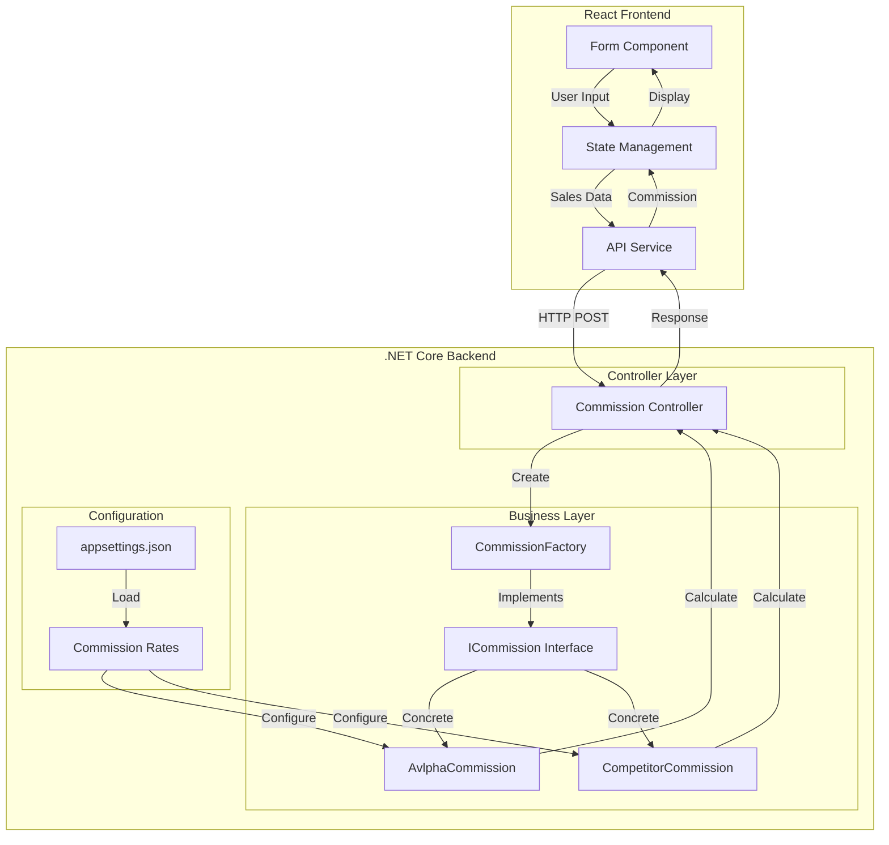

# Commission Calculator System Architecture

## System Overview



## Backend Architecture 🔧

### Core Components

* **Interface-Based Design**
  - `ICommission` interface
  - Implementations:
    - `AvlphaCommission`
    - `CompetitorCommission`

* **Configuration System**
  - ✨ Commission rates stored in appsettings.json
  - 🔄 Dynamic rate updates without code changes
  - 📊 Separate rates for:
    - Local sales
    - Foreign sales

* **Validation & Error Handling**
  - ✅ Input validation
  - 🚫 Error middleware
  - 🔍 Logging system

* **Security & Integration**
  - 🔒 CORS configuration
  - 🌐 API endpoint protection
  - 🤝 Frontend integration support

## Frontend Architecture 🎨

### User Interface Components

* **Form Management**
  - ✍️ Input validation
  - 🎯 Real-time feedback
  - 🔄 Reset functionality

* **State Management**
  - 📊 Form data state
  - 💫 Loading states
  - 📝 Results display

* **User Experience**
  - 💰 Currency formatting
  - ⚡ Toast notifications
  - 🎨 Responsive design

## Communication Layer 🌐

### API Integration

* **RESTful Architecture**
  ```
  POST /commission
  ```
  - Request: Sales data
  - Response: Commission calculations

* **Configuration**
  - 🔧 Environment variables
  - 🔌 API base URL
  - 📡 Endpoint mapping

* **Data Flow**
  - 📤 JSON request formatting
  - 📥 Response parsing
  - 🔄 Error handling

## Development Workflow 🛠️

### Setup Requirements

* **Backend**
  - .NET Core 8.0
  - Visual Studio 2022
  - SQL Server (optional)

* **Frontend**
  - Node.js
  - npm/yarn
  - React 18+

### Environment Configuration

```bash
# Frontend (.env)
REACT_APP_API_URL=https://localhost:5000

# Backend (appsettings.json)
"Commission": {
  "Avalpha": {
    "Local": "0.20",
    "Foreign": "0.35"
  },
  "Competitors":  {
    "Local": "0.02",
    "Foreign": "0.0755"
  }
  
}
```


